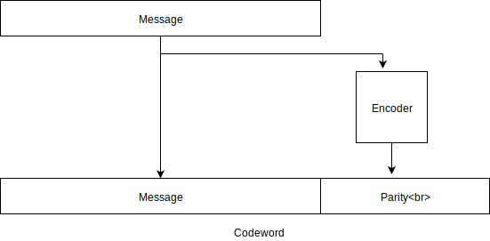

# Reed-Solomon Coding

## Introduction

Reed-Solomon is a forward error correction CODEC.  Forward error correction 
provides a way to protect data from errors incurred during transmission or 
storage - an inevitability in our imperfect world.  We will introduce the 
main concepts of Reed-Solomon coding but for a much more thorough discussion 
please refer to this rather execellent 
[BBC white paper](https://downloads.bbc.co.uk/rd/pubs/whp/whp-pdf-files/WHP031.pdf).

## Block structure

We start with the message we wish to send (or store).  The message is of 
length `k` and comprised of `m` bit symbols.  To this the Reed-Solomon encoder 
will add `2*t` parity protection symbols to form a code word of length `n`.

 

Reed-Solomon codes are systematic - that is the original message is contained 
within the computed codeword.

The decoder will receive the code word which may have been corrupted.  If the 
number of errors is less than some threshold it will recover the original 
message intact.

## Parameter relationships

The Reed-Solomon CODEC is configured by a number of related parameters: `m`, `k`, `n`, `t`.
 
`m` is the number of bits in each symbol.  It also defines `n` as follows:

$n <= 2^m - 1$

Many real world codes choose $m=8$ as then each symbol maps to a single byte.  This allows 
code words of up to 255 bytes.

The value `t` defines the error correction capability of the Reed-Solomon code.  It also
implies the input message length `k` as follows:

$k = n - 2*t$
